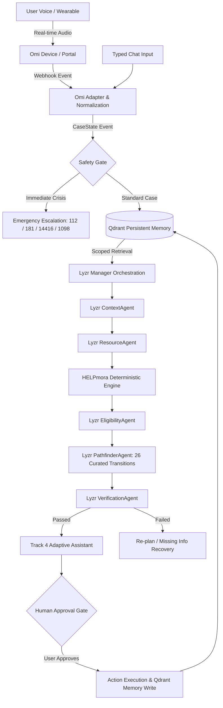

# HELPmora: Omi + Qdrant + Lyzr + Jac Architecture

> **From your problem to your next step.**  
> Authoritative system architecture integrating Omi real-time voice, Qdrant scoped persistent memory, Lyzr agent orchestration, and the deterministic HELPmora civic-policy engine.

---

## 1. System Overview

HELPmora is built on a fundamental separation of concerns:
- **Conversational understanding & voice ingestion** are handled adaptively (Omi + Lyzr Context Agent).
- **Persistent episodic & application memory** is managed by Qdrant with strict tenant isolation.
- **Workflow delegation, retry control & execution DAGs** are orchestrated by Lyzr (Manager + SuperFlow pattern).
- **Eligibility scoring and statutory policy truth** remain strictly deterministic inside the Jac engine (`score.jac` and the curated 40-program Indian welfare catalog).



---

## 2. Omi Voice Input Flow

The Omi integration layer receives voice transcripts and audio events directly from Omi wearables or developer webhooks:

1. **Webhook Ingestion**: `POST /api/omi/events` receives JSON payloads containing transcript segments.
2. **Signature & Secret Verification**: The adapter validates the `OMI_WEBHOOK_SECRET` header or query token.
3. **Normalization**: Regardless of raw format differences, the payload is normalized into a standard structure:
   ```json
   {
       "session_id": "omi_sess_001",
       "user_id": "user_123",
       "text": "I lost my job two months ago. I am behind on rent, I have two children...",
       "language": "en",
       "timestamp": "2026-10-06T13:45:00Z",
       "source": "omi",
       "event_id": "b3f0e8e8b4cc..."
   }
   ```
4. **Deduplication Protection**: Fingerprints are cached with a 10-minute TTL to reject replayed audio packets.
5. **Redacted Logging**: No raw transcript text is stored in application logs; only event IDs, word counts, and session metrics are recorded.

---

## 3. Qdrant Scoped Semantic Memory Model

Memory persistence is powered by Qdrant in collection `helpmora_memory`.

### Memory Types
- `conversation`: Turns and user statements (subject to user consent).
- `profile_fact`: Extracted demographic and income facts.
- `application`: Submitted welfare application milestones.
- `recommendation`: System-generated scheme suggestions.
- `document`: References to uploaded or required documents.
- `outcome`: Final approvals, denials, or grievance filings.
- `preference`: User interface preferences and accessibility modes.
- `case_event`: Operational audit events.

### Scoped Multi-Tenant Isolation
All queries strictly enforce tenant boundaries:
```python
filter_condition = models.Filter(
    must=[models.FieldCondition(key="user_id", match=models.MatchValue(value=current_user_id))]
)
```
User B can never retrieve or observe User A's data under any condition.

---

## 4. Lyzr Agent Orchestration

The system employs 6 specialized Lyzr agents, each with a single responsibility:

| Agent | Responsibility | Input | Output |
|---|---|---|---|
| **ContextAgent** | Context & profile extraction | Raw input + Qdrant memories | Structured demographics, income in ₹, household size |
| **ResourceAgent** | Catalog filtering | Needs category + location | Candidate schemes from `resources.json` (40 programs) |
| **EligibilityAgent** | Deterministic engine bridge | Candidates + User profile | Calibrated scores & counterfactual reasons |
| **PathfinderAgent** | Alternative route synthesis | Rejections / Borderline schemes | Bridge pathways from `transitions.json` (26 paths) |
| **VerificationAgent** | Statutory validity gate | Recommendations + Evidence | `passed` / `failed` status with issue list |
| **ActionAgent** | Workflow & next steps assembly | Verified recommendations | Action cards + Human approval requirement |

---

## 5. CaseState Contract

Agents coordinate via a typed, serializable `CaseState`:

```json
{
  "case_id": "case_abc123",
  "user_id": "usr_99",
  "session_id": "sess_01",
  "source": "omi",
  "raw_input_text": "...",
  "language": "en",
  "profile": {
    "income_monthly": 8000.0,
    "income_annual": 96000.0,
    "household_size": 3,
    "has_children": true
  },
  "needs": ["housing"],
  "retrieved_memories": [...],
  "candidate_resources": [...],
  "eligibility_results": [...],
  "pathways": [...],
  "documents": [...],
  "evidence": [...],
  "verification": {
    "status": "passed",
    "issues": [],
    "evidence_ids": ["user_reported_needs", "income_statement"]
  },
  "workflow": {
    "current_step": "review",
    "waiting_approval": true
  },
  "actions": [...],
  "status": "waiting_approval",
  "execution_trace": [...]
}
```

---

## 6. Jaclang Deterministic Policy Engine

- **Authoritative Source of Truth**: Evaluates hard income ceilings, citizenship gates, and household criteria in closed-form mathematical logic (`score.jac`).
- **Zero LLM Policy Hallucination**: LLMs are strictly forbidden from modifying or computing benefit eligibility.
- **Calibrated Tiers**: Programs return `likely eligible`, `needs information`, or `ineligible / borderline`.

---

## 7. Pathfinder (26 Curated Transitions)

When direct access to a welfare program fails (or an earlier application was rejected):
- Traverses the 26 curated transitions in `transitions.json`.
- Identifies bridge programs (e.g., Shelter for Urban Homeless [SUH] assisting with biometric documentation to transition into PMAY-U EWS housing).
- Never hallucinates non-existent edges.

---

## 8. Verification Gate

Every consequential recommendation must pass:
1. **Catalog Existence**: Program must exist in official Indian welfare catalog.
2. **Deterministic Eligibility**: Program cannot be planned if statutory criteria failed.
3. **Evidence Validation**: User profile must substantiate claimed criteria.
4. **Required Document Checklist**: Form prerequisites must be accounted for.
5. **Program Capacity**: Program cannot be marked closed.

---

## 9. Track 4 Adaptive Assistant (Voice-to-Form & Workflow)

- **Step-by-step Stepper**: Personal -> Household -> Income -> Category -> Documents -> Review.
- **Voice-to-Form**: Natural speech ("My monthly income is eight thousand rupees") converts to structured fields (`₹8,000`) with an explicit confirmation step.
- **Field Help ("Ask HELPmora")**: Explains complex welfare terms in clear language.
- **Guided Recovery**: Offers alternatives if documents are missing (e.g. BPL ration card, e-District portal link).
- **Human Approval**: Consequential external actions are never executed silently.
- **Accessibility Modes**: Real toggles for Voice-First, Large Text, High Contrast, Reduced Motion, and Simple Language.

---

## 10. Privacy & Safety Controls

- **Hotline Safety Gate**: Emergency phrases bypass normal multi-agent pipelines directly to 112, 181, 14416, or 1098.
- **Granular Memory Settings**: Users can toggle Conversation Memory, Application History, Document Storage, and Raw Voice Retention.
- **Right to be Forgotten**: One-click deletion wipes all Qdrant vectors for the user immediately.

---

## 11. Failure & Degradation Behavior

| Component Failure | Fallback Strategy |
|---|---|
| **Omi Offline** | Standard typed chat remains 100% operational |
| **Qdrant Offline** | Falls back to in-memory store; marks memory as temporary |
| **Lyzr API Down** | Deterministic local multi-agent fallback executes DAG |
| **Verification Failed** | Blocks external action execution; prompts user for clarification |
